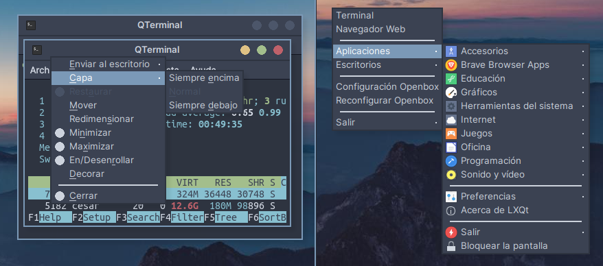
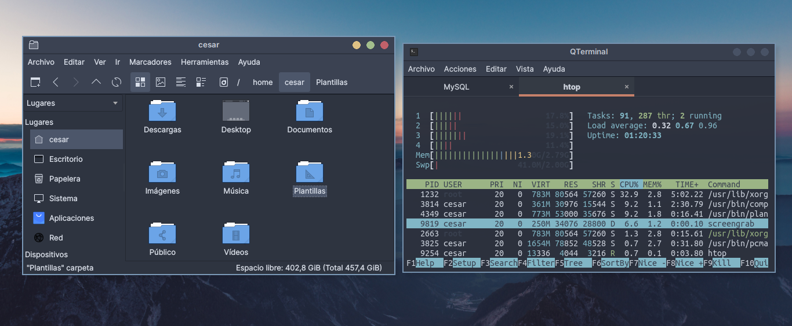

# Nord Openbox theme

A openbox theme with Nord color palette to combine with GTK+, Plasma and Kvantum Nordic theme.

## Screenshots

**Window and menu view** 

 

**Nordic-darker Kvantum theme + Nord Openbox**

 

## Install
Place the repository folders: **Nord-Openbox** in the <code>/home/your-user/.themes</code> directory and select with the **Openbox configuration** the theme of your preference.

## Credits

Based on: 

- Icons buttons of "[**Arc-theme**](https://github.com/horst3180/arc-theme)" by **horst3180**.
- "[**Nord color palette**](https://github.com/arcticicestudio/nord)" by **Artic Ice Studio**.

## License

[MIT License ](./LICENSE)
